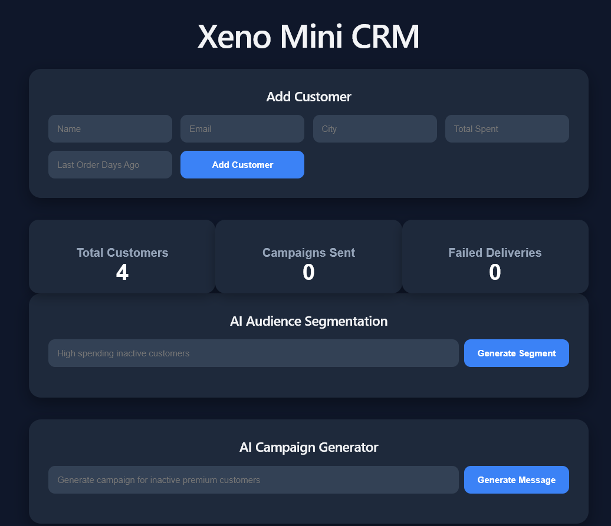
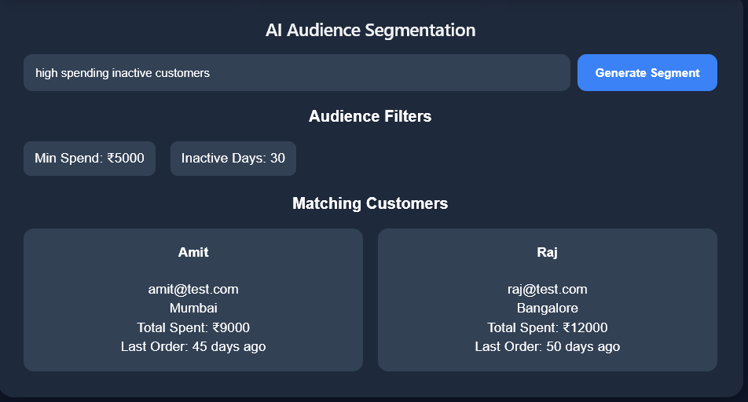
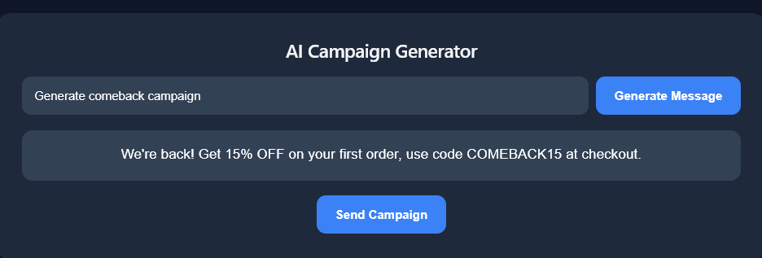

# Xeno Mini CRM

AI-powered customer relationship management platform with intelligent audience segmentation and automated campaign generation.

## Live Demo

Frontend: https://xeno-mini-crm-umber.vercel.app/
Backend API: https://xeno-backend-uqlu.onrender.com

---

## Features

### AI Audience Segmentation

Generate customer filters using natural language prompts.

Examples:

* High spending inactive customers
* Premium customers from Chennai
* Dormant users with high purchases

### AI Campaign Generation

Generate personalized marketing campaigns automatically using AI.

### Customer Management

* Add customers
* Track spending
* Monitor inactivity
* Store customer details

### Campaign Delivery Tracking

* Track sent campaigns
* Track failed deliveries
* Delivery history dashboard

### Modern UI

Responsive React frontend with clean dashboard design.

---

## Tech Stack

### Frontend

* React
* Vite
* Axios
* CSS

### Backend

* FastAPI
* Python
* SQLite
* SQLAlchemy

### AI Integration

* Groq API / OpenAI API

### Deployment

* Frontend: Vercel
* Backend: Render

---

## Project Architecture

Frontend (React)
↓
FastAPI Backend
↓
SQLite Database + AI Services
↓
Channel Service for Campaign Delivery

---

## Screenshots

### Dashboard




### Audience Segmentation




### Campaign Generation




---

## Installation

### Clone Repository

```bash
git clone https://github.com/Advaidhbaskar/xeno-mini-crm.git
cd xeno-mini-crm
```

### Backend Setup

```bash
cd backend
python -m venv venv
venv\Scripts\activate
pip install -r requirements.txt
uvicorn main:app --reload
```

### Frontend Setup

```bash
cd frontend
npm install
npm run dev
```

---

## Future Improvements

* Authentication system
* Advanced analytics dashboard
* Real email/SMS integration
* Smarter AI segmentation
* Multi-user support

---

## Author

Advaidh Baskar
